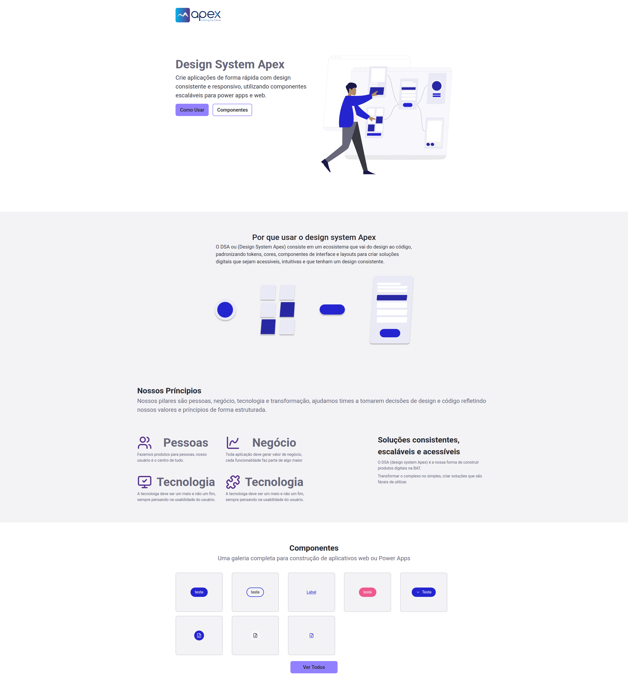
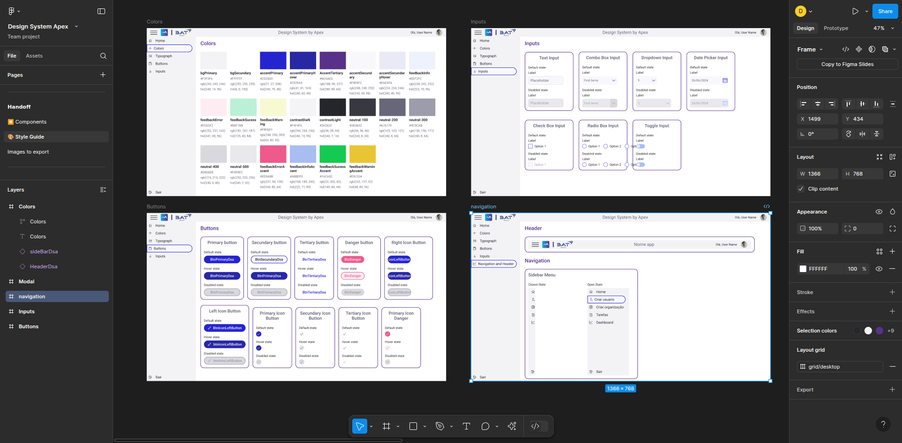

# 💡 DSA - Design System Apex

Crie aplicações incriveis com Power Apps usando o design system by Apex.

__Você pode ver esse projeto bem [Aqui](https://dener-garcia.github.io/design-system-apex/)__


🖥️ Home                                        | 🖥️ Componentes Figma   
:----------:                                            | :--------------: 
   |  

## ⚙️ Funcionalidades

- ✅ Tokens reutilizáveis de design (cores, tipografia, espaçamento)
- ☑️ Componentização com HTML, CSS e JS via Vite
- ✅ HTML semântico
- ☑️ Pronto para uso em Power Apps (via YAML)
- ✅ Disponível online via GitHub Pages
- ☑️ Animação com SVG

## 🧰 Bibliotecas

- ✅ Figma - utilizado para criar o design visual, tokens e layout base
- ☑️ Power Apps + YAML - componentes exportáveis para ambientes corporativos
- ✅ GitHub Pages - onde a aplicação está publicada para acesso imediato

## ⬇️ Rodando o projeto

1. Certifique-se de ter o Node.js instalado.
2. Clone o repositório.
3. Acesse a pasta com:
```
    cd design-system-apex
```
4. Se precisar inserir um bloco de código
```
    npm install
```
5. Rode localmente:
```
    npm run dev
```
7. Acesse no navegador: http://localhost:5173

## 🧩 Tecnologías Utilizadas

<div align="left">
  
  
  
  
  
  
  
  
</div>

## 💸 Contribua com esse projeto

Quer contribuir? Faça um fork do repositório e siga as diretrizes abaixo:

Crie seus componentes no Power Apps com YAML

Use os tokens de design definidos no projeto

Mantenha os componentes acessíveis e responsivos

Envie um Pull Request com sua contribuição

## 🤯 Aprendizados

Ao desenvolver este Design System, tive a oportunidade de viver o ciclo completo de criação de um produto: do zero no Figma até a entrega funcional no navegador e no Power Apps. Como designer, esse projeto foi desafiador e enriquecedor, pois envolveu decisões técnicas e visuais que exigiram adaptação, aprendizado e estratégia.

Criei um sistema:

Documentado

Reutilizável

Disponível online

Com foco em acessibilidade, performance e clareza visual

Essa experiência fortaleceu minha visão como designer de produto e me aproximou ainda mais do universo de desenvolvimento front-end.

## 🏆 Reconhecimentos

O Design System Apex faz parte da iniciativa da BAT para consolidar boas práticas de design e desenvolvimento em soluções escaláveis, responsivas e acessíveis, na qual tive o prazer de desenvolver do zero até o deploy.

## 💬 Vamos nos conectar?

<div align="left">
  <a href="https://" target="_blank">
    
  </a>
    
  <a href="https://" target="_blank">
  
  </a>
    
  <a href="https://" target="_blank">
    
  </a>
    
  <a href="https://" target="_blank">
    
  </a>
</div>